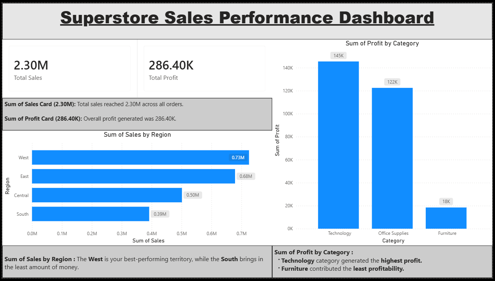

# Superstore Sales Dashboard

## Objective

Create visualizations and business insights using Power BI.

## Dataset

Superstore Sales Dataset

## Tools Used

* Power BI
* CSV Dataset

## Dashboard Features

* Total Sales and Profit KPI Cards
* Sales by Region
* Profit by Category
* Business Insight Text Boxes

## Key Insights

* West region generated the highest sales.
* South region showed the lowest sales performance.
* Technology category generated the highest profit.
* Furniture category contributed the least profitability.

## Outcome

Created a clean and interactive dashboard focused on business insights and visual storytelling.

## Superstore Sales Dashboard

## Files Included

* Power BI Dashboard (`Superstore_Sales_Dashboard.pbix`)
* Dashboard PDF (`Superstore_Sales_Dashboard.pdf`)
* Dashboard Screenshot (`Superstore_Sales_Dashboard.png`)
* Dataset File (`Sample - Superstore.csv`)
* README File (`README.md`)
